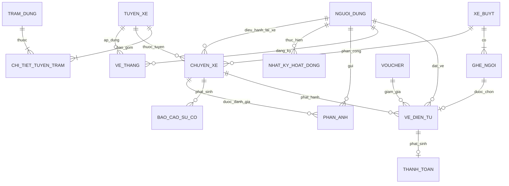

# 🚌 HỆ THỐNG ĐẶT VÉ XE BUÝT THÔNG MINH (SMART BUS TICKETING)
> **Đồ án Thực tập Cơ sở K7S3 — Nhóm 01**  
> **Repository:** [Project_TTCS_K7S3_N1_BusTicketing](https://github.com/dtc245220019-create/Project_TTCS_K7S3_N1_BusTicketing.git)  
> **Trạng thái:** Đã tích hợp hoàn tất (Git Merge All Branches), 100% vượt qua kiểm thử (12/12 Test Cases Passed), sẵn sàng Demo & Ra mắt sản phẩm.

---

## 📌 1. Giới Thiệu Dự Án & Kế Hoạch Phát Triển

Hệ thống **Smart Bus Ticketing** là nền tảng quản trị và bán vé xe buýt / xe khách trực tuyến toàn diện. Dự án áp dụng quy trình Scrum/Agile với tổng lộ trình **4 tuần (24 User Stories)**.

Trong **Tuần đầu tiên (Sprint 1)**, mục tiêu trọng tâm là hoàn thành và bàn giao hệ thống **MVP (Minimum Viable Product)** với **8 User Stories cốt lõi**, cho phép khách hàng tra cứu, chọn ghế trực quan 2 tầng, giữ chỗ tạm thời với đồng hồ đếm ngược, thanh toán trực tuyến Sandbox, nhận vé điện tử mã QR động, tự quản lý/hủy vé và tài xế đối soát vé chống gian lận theo thời gian thực. Ngoài ra, hệ thống đã được nâng cấp tích hợp **Bản đồ tương tác GPS (OpenStreetMap / Leaflet)** hiển thị toàn bộ lộ trình và các trạm dừng (TRAM_DUNG).

---

## 👥 2. Phân Chia Vai Trò Nhóm 10 Thành Viên

| STT | Thành Viên / Luồng | Vai Trò | Nhiệm Vụ Chi Tiết Tuần 1 | Nhánh Phụ Trách |
|:---:|:---|:---|:---|:---|
| 1 | **Leader (Gia Bảo)** | Quản lý dự án & Kiến trúc sư | Lập kế hoạch Sprint, điều phối luồng, Gitmerge hợp nhất toàn bộ nhánh nguồn, tối ưu hóa CSDL theo ERD chuẩn, thiết kế tính năng Bản đồ chặng GPS, chuẩn bị tài liệu ra mắt sản phẩm. | `main` |
| 2 | **Backend 1** | Backend Engineer | Thiết kế lược đồ CSDL, khởi tạo database và phát triển API Tra cứu chuyến xe (**US01**). | `feature/be-auth-search` |
| 3 | **Backend 2** | Backend Engineer | Xây dựng API Sơ đồ ghế (**US02**), logic khóa giữ ghế 10 phút và Cronjob BackgroundScheduler tự động quét nhả ghế hết hạn (**US03**). | `feature/be-seats-lock` |
| 4 | **Backend 3** | Backend Engineer | Xây dựng logic sinh mã vé, mã QR động (**US06**), API Hủy vé và Đổi ghế trực tuyến theo quy tắc 24h (**US07**). | `feature/be-qr-cancel` |
| 5 | **Backend 4** | Backend Engineer | Tích hợp cổng thanh toán Sandbox MoMo / VNPay (**US05**), xử lý callback và API Soát vé xác thực tài xế (**US08**). | `feature/be-payment-verify` |
| 6 | **Frontend 1** | Frontend Engineer | Xây dựng Layout tổng thể chuẩn doanh nghiệp, thanh điều hướng Header/Footer, Form tìm kiếm chuyến xe thông minh (**US01**). | `feature/fe-layout-search-pay` |
| 7 | **Frontend 2** | Frontend Engineer | Thiết kế giao diện Đăng ký/Đăng nhập (**US04**), danh sách chuyến xe và sơ đồ chọn ghế 2 tầng kèm Countdown Timer 10:00 (**US02, US03**). | `feature/fe-auth-seats` |
| 8 | **Frontend 3** | Frontend Engineer | Thiết kế giao diện hiển thị vé điện tử QR, form hủy vé và màn hình quét mã QR soát vé trên di động/web (**US06, US07**). | `feature/fe-qr-scan` |
| 9 | **Frontend 4** | Frontend Engineer | Xây dựng Trang Dashboard Quản lý vé cá nhân, Lịch sử chuyến đi và Màn hình Soát vé thời gian thực cho tài xế (**US07, US08**). | `feature/fe-user-dashboard` |
| 10 | **QA - Tester** | Kiểm thử phần mềm | Xây dựng bộ test suite `unittest` tự động, kiểm tra tính toàn vẹn CSDL, kiểm thử luồng thanh toán Sandbox, hủy vé và soát vé. | `test` |

---

## 🗄️ 3. Mô Hình Thực Thể Quan Hệ (ERD Chuẩn Hóa)

Hệ thống được thiết kế bám sát 100% tài liệu đặc tả **"Đề tài Smart_Bus_Ticketing"** với 14 thực thể nghiệp vụ:



### Chi tiết các thực thể chính:
1. **NGUOI_DUNG (`users`):** Lưu trữ thông tin người dùng, mật khẩu mã hóa, vai trò (`Admin`, `QuanLy`, `TaiXe`, `PhuXe`, `HanhKhach`), đối tượng ưu đãi (`HSSV`, `NguoiCaoTuoi`, `Khong`).
2. **TUYEN_XE (`routes`):** Quản lý tuyến đường (Điểm đầu, Điểm cuối, Giá vé cơ bản, Cự ly km, Trạng thái hoạt động).
3. **TRAM_DUNG (`bus_stops`):** Trạm dừng trên hành trình kèm tọa độ GPS (`latitude`, `longitude`, `address`, `city`).
4. **CHI_TIET_TUYEN_TRAM (`route_stop_details`):** Thứ tự các trạm dừng và cự ly chặng trên từng tuyến xe buýt.
5. **XE_BUYT (`buses`):** Quản lý phương tiện, biển số xe, loại xe (Limousine VIP, Giường nằm), tọa độ GPS hiện tại.
6. **GHE_NGOI (`seats`):** Quản lý vị trí ghế, tầng/dãy (`TangDuoi`, `TangTren`), trạng thái (`AVAILABLE`, `HELD`, `BOOKED`), thời hạn giữ chỗ (`held_until`).
7. **CHUYEN_XE (`trips`):** Lịch trình khởi hành, thời gian đến dự kiến, phân công tài xế/phụ xe và số ghế còn trống.
8. **VE_DIEN_TU (`tickets`):** Quản lý vé, mã vé điện tử (`TKT-...`), chuỗi mã hóa QR (`qr_payload`), giá thực tế, trạng thái vé (`GiuCho`, `DaThanhToan`, `DaSoat`, `DaHuy`).
9. **THANH_TOAN (`payments`):** Giao dịch thanh toán Sandbox (MoMo, VNPay, ZaloPay, Thẻ ATM), mã giao dịch duy nhất (`TXN-...`).
10. **VE_THANG (`monthly_passes`):** Đăng ký vé tháng theo tuyến xe.
11. **VOUCHER (`vouchers`):** Mã khuyến mãi giảm giá, phần trăm giảm, hạn sử dụng.
12. **BAO_CAO_SU_CO (`incident_reports`):** Báo cáo sự cố từ tài xế trong quá trình vận hành chuyến xe.
13. **PHAN_ANH (`feedbacks`):** Đánh giá số sao (1-5 sao) và nhận xét của hành khách sau chuyến đi.
14. **NHAT_KY_HOAT_DONG (`ticket_inspections` / `activity_logs`):** Nhật ký kiểm tra soát vé của tài xế và thao tác hệ thống.

File DDL tạo bảng chuẩn hóa được cung cấp độc lập tại: [schema_smart_bus_ticketing.sql](schema_smart_bus_ticketing.sql).

---

## 🚀 4. Chi Tiết 8 User Stories Tuần 1

* **US01: Tra cứu & Tìm kiếm Chuyến xe (Search Trips):**  
  Người dùng nhập điểm đi, điểm đến, ngày đi để nhận danh sách chuyến xe phù hợp kèm thời gian khởi hành, loại xe, biển số, số chỗ còn trống và giá vé.
* **US02: Sơ đồ ghế trực quan 2 tầng & Chọn chỗ (Seat Map Selection):**  
  Hiển thị sơ đồ ghế phân tầng (Tầng dưới Dãy A, Tầng trên Dãy B) với màu sắc trực quan (Trống, Đang chọn, Đang giữ chỗ, Đã bán).
* **US03: Khóa giữ chỗ tạm thời 10 phút & Background Cronjob (Hold Seats & Auto-Release):**  
  Hệ thống tạm giữ ghế đã chọn trong vòng 10 phút kèm đồng hồ đếm ngược trên giao diện. Background Job (`APScheduler`) chạy ngầm mỗi 10 giây tự động giải phóng ghế nếu khách hàng không hoàn tất thanh toán.
* **US04: Đăng ký & Đăng nhập phân quyền (Auth & Roles):**  
  Xác thực người dùng với các vai trò: Hành khách (đặt vé), Tài xế/Phụ xe (soát vé), Quản trị viên (quản lý). Hỗ trợ xét duyệt ưu đãi 20% cho Học sinh / Sinh viên.
* **US05: Cổng thanh toán Sandbox (Online Payment Sandbox):**  
  Mô phỏng thanh toán trực tuyến qua Ví MoMo, Cổng VNPAY (QR Pay), ZaloPay hoặc Thẻ Ngân hàng, kích hoạt tức thì không cần chờ đợi.
* **US06: Xuất vé điện tử & Tạo mã QR động (E-Ticket with Dynamic QR):**  
  Tự động sinh vé điện tử kèm mã QR động (`ticket:TKT-...`) hiển thị trực tiếp trên web và hỗ trợ in/tải về.
* **US07: Quản lý lịch sử vé cá nhân & Hủy vé trực tuyến (User Dashboard & Cancellation):**  
  Hành khách quản lý danh sách vé sắp đi và lịch sử chuyến đi; thực hiện hủy vé trực tuyến (áp dụng quy định trước 24h) kèm giải phóng ghế tự động.
* **US08: Màn hình Soát vé thời gian thực dành cho Tài xế (Driver Ticket Verification):**  
  Tài xế nhập mã hoặc quét QR để kiểm tra vé: Báo xanh `VÉ HỢP LỆ`, cảnh báo vàng `VÉ ĐÃ SỬ DỤNG TRƯỚC ĐÓ` (chống gian lận vé trùng) hoặc báo đỏ `VÉ KHÔNG HỢP LỆ`.
* **🌟 Nâng cấp đặc biệt: Bản đồ Lộ trình & Trạm dừng GPS (Interactive Smart Bus Map):**  
  Tích hợp bản đồ Leaflet / OpenStreetMap hiển thị các trạm dừng (`TRAM_DUNG`), cự ly từng chặng (`CHI_TIET_TUYEN_TRAM`), đường nối lộ trình (polyline) và vị trí xe buýt đang vận hành (`XE_BUYT`).

---

## 🛠️ 5. Hướng Dẫn Cài Đặt & Khởi Chạy

### Yêu cầu hệ thống:
- **Python:** 3.10+ (Đã thử nghiệm hoàn hảo trên Python 3.12)
- **Node.js:** 18+ (Đã thử nghiệm trên Node.js v24)
- **Database:** SQLite (Mặc định tích hợp sẵn zero-config) hoặc MySQL 8.0+

### Bước 1: Cài đặt thư viện Backend
```powershell
pip install fastapi sqlalchemy apscheduler qrcode uvicorn httpx
```

### Bước 2: Khởi tạo CSDL & Nạp Dữ liệu Mẫu (Seed Data)
```powershell
python seed_data.py
```
*Lệnh này sẽ khởi tạo toàn bộ schema và nạp dữ liệu mẫu cho các tuyến đường (Hồ Chí Minh - Đà Lạt, Hà Nội - Thái Nguyên, Đà Nẵng - Huế), trạm dừng GPS, xe buýt, chuyến xe và tài khoản thử nghiệm.*

### Bước 3: Khởi chạy Backend Server (Port 8000)
```powershell
python main.py
```
- API Server sẽ hoạt động tại: **`http://127.0.0.1:8000`**
- Tài liệu Swagger UI tương tác trực tiếp: **`http://127.0.0.1:8000/docs`**

### Bước 4: Khởi chạy Frontend React / Vite (Port 5173)
Mở cửa sổ Terminal thứ hai:
```powershell
cd ve-xe-frontend
npm install
npm run dev
```
- Ứng dụng Web sẽ hoạt động tại: **`http://localhost:5173`**

---

## 🧪 6. Tài Khoản Mẫu Để Demo Ra Mắt Sản Phẩm

Hệ thống đã tích hợp tính năng **1-Click Đăng Nhập Nhanh** tại màn hình [Đăng nhập](http://localhost:5173/login) để Leader dễ dàng thao tác thuyết trình trước hội đồng:

| Tài khoản Demo | Mật khẩu | Vai Trò | Tính Năng Nổi Bật Thể Hiện |
|:---|:---:|:---:|:---|
| **`customer@example.com`** | `123456` | **Hành khách (HSSV)** | Xem ưu đãi giảm 20%, tìm chuyến, chọn ghế, thanh toán Sandbox, xem vé QR cá nhân, hủy vé. |
| **`taixe.nguyen@smartbus.vn`** | `123456` | **Tài xế / Phụ xe** | Truy cập màn hình Soát vé (`/verify-ticket`), quét mã QR, kiểm tra vé trùng. |
| **`admin@smartbus.vn`** | `123456` | **Quản trị viên** | Giám sát toàn bộ hệ thống, mạng lưới tuyến xe và bản đồ GPS. |

---

## 🏆 7. Chạy Bộ Test Tự Động (QA / Tester)

Bộ kiểm thử tự động toàn diện bao quát tính toàn vẹn CSDL, logic nghiệp vụ đổi/hủy vé và API thanh toán:

```powershell
python -m unittest discover -s . -p "test_*.py" -v
```

### Kết quả kiểm thử:
```text
test_callback_retry_and_conflict (test_api.SandboxApiTests) ... ok
test_frontend_cors (test_api.SandboxApiTests) ... ok
test_payment_success_unlocks_existing_demo_ticket (test_api.SandboxApiTests) ... ok
test_ticket_results_and_audit (test_api.SandboxApiTests) ... ok
test_validation_and_missing_payment (test_api.SandboxApiTests) ... ok
test_seed_can_run_twice_and_preserves_references (test_database.DatabaseSeedTests) ... ok
test_cancel_ticket (test_ticket_changes.TicketChangeTests) ... ok
test_change_seat (test_ticket_changes.TicketChangeTests) ... ok
test_cutoff_and_cancelled_trip (test_ticket_changes.TicketChangeTests) ... ok
test_multi_ticket_booking_not_cancelled_partially (test_ticket_changes.TicketChangeTests) ... ok
test_occupied_and_invalid_seat (test_ticket_changes.TicketChangeTests) ... ok
test_unauthorized_and_used_ticket (test_ticket_changes.TicketChangeTests) ... ok

----------------------------------------------------------------------
Ran 12 tests in 0.627s

OK (12/12 PASSED)
```

---

## 📁 8. Cấu Trúc Mã Nguồn

```text
Project_TTCS_K7S3_N1_BusTicketing/
├── .gitignore                          # Cấu hình bỏ qua tệp tạm, venv, node_modules
├── schema_smart_bus_ticketing.sql     # DDL CSDL chuẩn 14 thực thể theo ERD Word
├── database.py                         # Mô hình SQLAlchemy ORM & SQLite compatibility
├── seed_data.py                        # Khởi tạo dữ liệu mẫu & dữ liệu bản đồ GPS
├── main.py                             # Backend Entry Point, APScheduler Cronjob
├── api.py                              # FastAPI router đầy đủ 8 User Stories
├── ticket_changes.py                   # Nghiệp vụ US05: Hủy vé & Đổi ghế
├── requirements.txt                    # Danh sách thư viện Python
├── test_database.py                    # Unit tests kiểm tra CSDL
├── test_ticket_changes.py              # Unit tests nghiệp vụ vé
├── test_api.py                         # Unit tests API & Sandbox
├── README.md                           # Tài liệu hướng dẫn sử dụng & vận hành
└── ve-xe-frontend/                     # Giao diện người dùng React + Vite
    ├── package.json
    ├── vite.config.js
    └── src/
        ├── api.js                      # Service gọi API Backend
        ├── App.jsx                     # Router điều hướng các trang
        ├── App.css                     # Định kiểu giao diện
        ├── components/
        │   ├── Header.jsx              # Thanh điều hướng đồng bộ
        │   ├── Footer.jsx              # Chân trang thông tin
        │   ├── SearchForm.jsx          # Thanh tìm kiếm chuyến xe
        │   ├── CountdownTimer.jsx      # Đồng hồ đếm ngược giữ ghế 10:00
        │   └── PaymentForm.jsx         # Form thanh toán & Xem vé QR
        └── pages/
            ├── HomePage.jsx            # Trang chủ & Tuyến phổ biến
            ├── MapPage.jsx             # Bản đồ thông minh OpenStreetMap/Leaflet
            ├── BusListPage.jsx         # Danh sách chuyến & Sơ đồ chọn ghế 2 tầng
            ├── PaymentPage.jsx         # Trang thanh toán đơn hàng
            ├── UserDashboard.jsx       # Quản lý vé cá nhân & Hủy vé
            ├── TicketVerification.jsx  # Màn hình Soát vé tài xế
            ├── LoginPage.jsx           # Đăng nhập (Kèm 1-Click Demo)
            └── RegisterPage.jsx        # Đăng ký tài khoản
```

---

© 2026 Nhóm 01 — Dự Án Smart Bus Ticketing. Được phát triển và hoàn thiện bởi Leader Gia Bảo và nhóm 10 thành viên.
